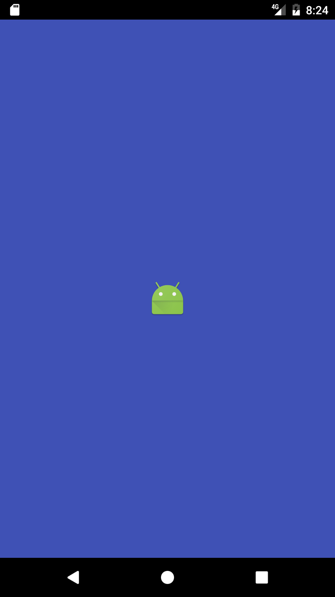

# Splash Screen Template

## What is this template?

It is a good practice to have a splash screen, a launch screen in your application
to improve the user experience. Don't let your users see a white screen.
Material design has guidelines about launch screen that you can read about on
their website [link here].  
You can read this article if you want to know a little more about how to implement a launch screen in Android.

It is possible that you don't really care about how to do a basic launch screen.
The template do the work for you, it will create the following type of splash screen:

The background of the splash screen is the color primary of the application (colorPrimary)
